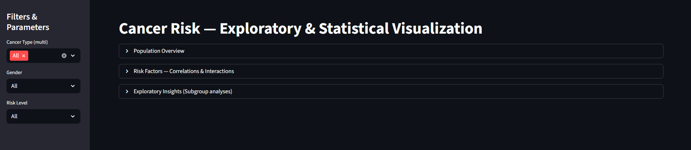
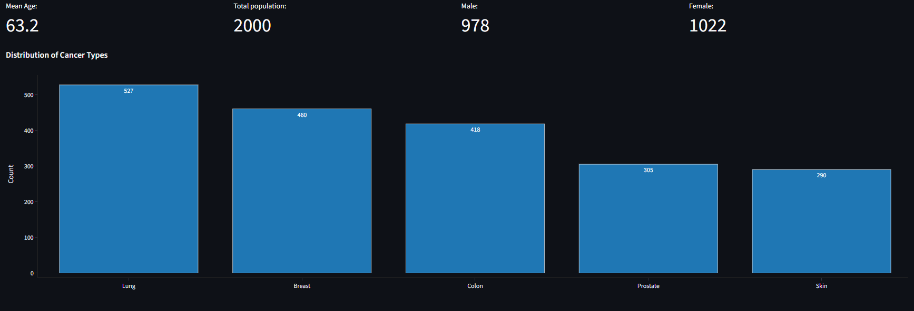
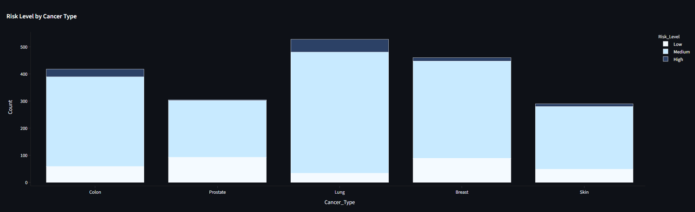
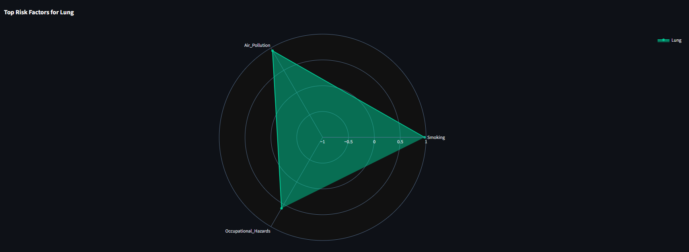
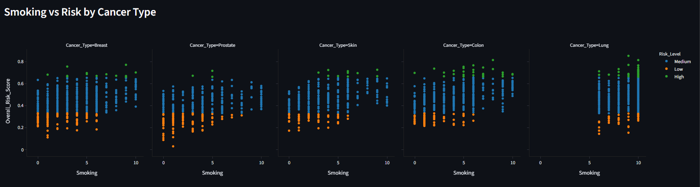

# CancerTrace: AI-Driven Cancer Risk Factor Analysis and Visualization

CancerTrace is an AI-powered tool that analyzes and visualizes cancer risk factors using machine learning. It employs a high-accuracy XGBoost model combined with SHAP for interpretability to identify key risk drivers (e.g., smoking, BMI, family history) across different cancer types. Results are presented in an interactive Streamlit dashboard, providing explainable insights for early risk assessment and prevention strategies.
Table of Contents

---

## Features
Installation
Usage
Screenshots
Data
Dependencies
Project Structure
Contributing
License
Acknowledgments

Features

Risk Factor Ranking: Uses XGBoost to compute permutation importance and Spearman correlations, ranking top-3 risk factors per cancer type (e.g., Breast, Colon, Lung).
Model Performance Metrics: Evaluates models with AUC (classification) or R² (regression), including auxiliary AUC for regression tasks via median binarization.
Interactive Dashboard: Streamlit-based UI for exploring data distributions, correlations, scatter plots, boxplots, and radar charts of risk factors.
Explainability: Integrates SHAP (planned extension) for feature importance visualization.
Data Processing: Handles CSV input, detects target/cancer columns, and outputs results to Excel for easy sharing.
Filtering & Visualization: Sidebar filters for cancer type, gender, and risk level; dynamic charts using Plotly for correlations, distributions, and trends.

---

## Installation

Clone the repository:
git clone https://github.com/mahyarmohammadlou/CancerTrace.git
cd CancerTrace

Create a virtual environment (recommended):
python -m venv venv
source venv/bin/activate  # On Windows: venv\Scripts\activate

Install dependencies:
pip install -r requirements.txt
(If requirements.txt is not present, install manually from the Dependencies section.)

---

## Usage
Running the Risk Factor Analysis Script

Execute the XGBoost-based analysis to generate top risk factors:
python scripts/top3_xgb_factors.py

This processes data/raw/cancer-risk-factors.csv and outputs data/processed/XLSX/xgb_top3_risks.xlsx with summaries and importances.

Launching the Streamlit Dashboard

Start the interactive visualization app:
streamlit run src/cancer_risk_analysis.py

Open your browser at http://localhost:8501 to explore the dashboard.
Use sidebar filters to subset data by cancer type, gender, or risk level.
View sections like Population Overview, Risk Factors Correlations, and Exploratory Insights.

Example Output

Excel Output: Contains sheets for top-3 summaries, all importances, and raw input data.
Dashboard Insights: Heatmaps for correlations, bar charts for distributions, LOESS trends for BMI vs. Risk Score, and radar charts for top factors per cancer.

---

## Screenshots:

Dashboard Overview: 

Population Overview:

Risk level by cancer type: 

Top Risk Factors Radar Chart: 

Smoking vs Risk by Cancer type: 

---

## Data

Input Dataset: data/raw/cancer-risk-factors.csv – A sample dataset with ~2000 entries across cancer types (Breast, Colon, Lung, Prostate, Skin). Columns include:

Patient_ID, Cancer_Type, Age, Gender, Smoking, Alcohol_Use, Obesity, Family_History, etc.
Target: Overall_Risk_Score (numeric risk score).

Processed Output: data/processed/XLSX/xgb_top3_risks.xlsx – Generated by the analysis script.

Dataset Source: This project utilizes the "Cancer Risk Factors Dataset" originally sourced from Kaggle, created by Tarek Masry. We formally acknowledge and thank Tarek Masry for making this valuable dataset publicly available, which forms the foundation for our analysis and visualizations. Without this resource, CancerTrace would not be possible. If you're the creator or have updates, please reach out!
Note: The dataset is synthetic for demonstration. For real-world use, replace with your own data ensuring compliance with privacy regulations (e.g., HIPAA).

---

## Dependencies

Python 3.8+
Core Libraries:

pandas, numpy, scikit-learn, xgboost (or fallback to sklearn.ensemble)
scipy, statsmodels

Visualization:

streamlit
plotly

Optional: shap for enhanced interpretability (future integration).

Install via:
pip install pandas numpy scikit-learn xgboost scipy statsmodels streamlit plotly

---

## Project Structure
CancerTrace/
├── asset/                # Assets like images or icons (e.g., screenshots)
├── data/
│   ├── raw/              # Raw input data (e.g., cancer-risk-factors.csv)
│   │   └── cancer-risk-factors.csv  # From Kaggle: https://www.kaggle.com/datasets/tarekmasryo/cancer-risk-factors-dataset
│   │
│   └── processed/        # Processed outputs (e.g., XLSX files)
│       └── xgb_top3_risks.xlsx
├── scripts/              # Utility scripts (e.g., top3_xgb_factors.py)
├── src/                  # Source code for core modules
├── .gitattributes        # Git attributes file
├── .gitignore            # Git ignore file
├── LICENSE               # License file (MIT recommended)
├── README.md             # This file

---

## Contributing
Contributions are welcome! Please follow these steps:

Fork the repository.
Create a feature branch (git checkout -b feature/YourFeature).
Commit your changes (e.g., `git commit -m 'Feat: Add analysis for new biomarker'`).
Push to the branch (git push origin feature/YourFeature).
Open a Pull Request.

For issues or suggestions, open a GitHub issue.
License
This project is licensed under the MIT License - see the LICENSE file for details.

---

## Acknowledgments

Built with open-source tools like XGBoost, Streamlit, and Plotly.
Special thanks to Tarek Masry for the Cancer Risk Factors Dataset – Your contribution to the open data community is greatly appreciated and enables projects like this to advance cancer risk research.
Inspired by real-world cancer risk research; always consult medical professionals for health advice.
